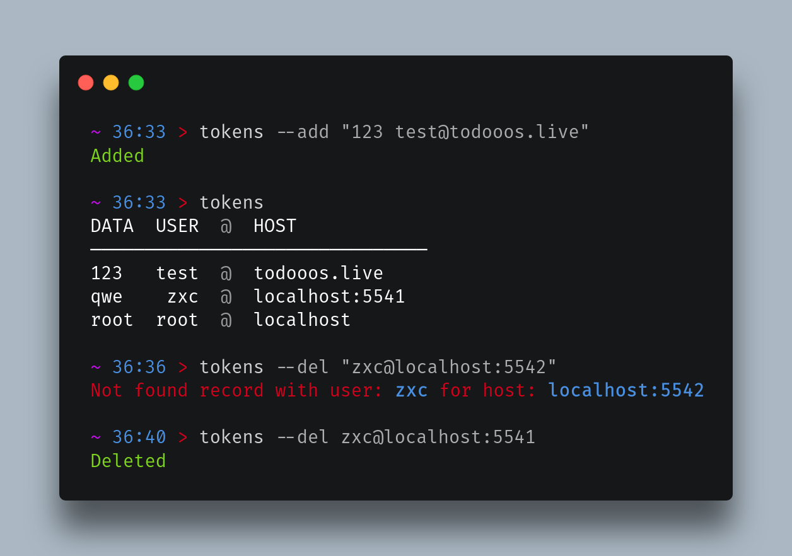

# Examples

> ``` bash
> tokens
> ```
> Output:
>
> ```
> DATA  USER  @  HOST           
> ───────────────────────────────
> 123   test  @  todooos.live   
> qwe    zxc  @  localhost:5541
> root  root  @  localhost
> ``` 


> ``` bash
> tokens --add "my_password qwerty@github.com"
> ```
> `Added`

> ``` bash
> tokens --del raeadyyyk@github.com"
> ```
> Output:
>
> `Deleted`
> 
> or
> 
> `Not found record with user: raeadyyyk for host: github.com`

# Installation

<ol>
   <li> download latest binary from <code><a href="https://github.com/readyyyk/little-pswd-mgr/releases">realises</a></code> </li>
   <li> to make <code>tokens</code> accessible from anywhere type: </li>
</ol>

```bash
echo -e "\n$(printf 'PATH=\"$PATH:%s\"' $(pwd))\n" >> ~/.bashrc | source ~/.bashrc
```

> or change `$(pwd)` to your installation path
> > `pwd` pastes your current terminal directory 

# Usage

| flags             | data                   | description     | 🚩 | 
|-------------------|------------------------|-----------------|----|
| <no flag\>        |                        | logs saved data |    |
| `-a` _or_ `--add` | "`data` `user`@`host`" | adds new        |    |
| `-d` _or_ `--del` | `user`@`host`          | deletes one     |    |

# TODO

- `--help`
- sort records with `-s` `user=test` `host=github.com`