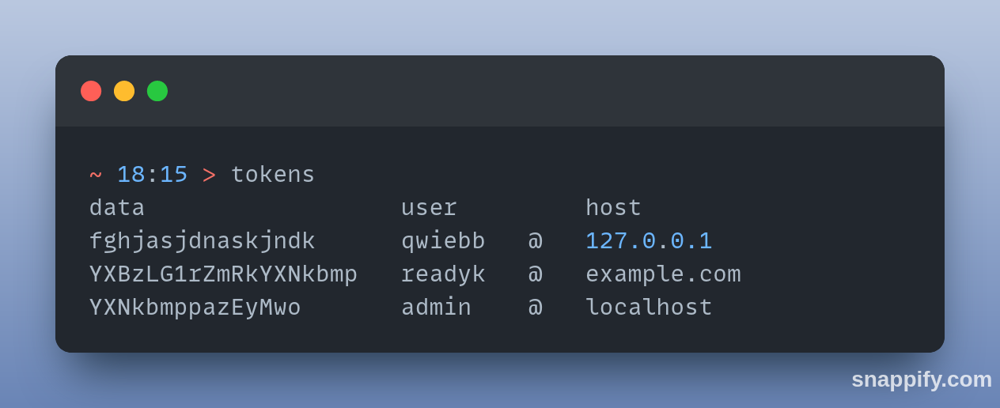

# Examples

> `tokens`
> ```
> data                  user         host                   
> fghjasjdnaskjndk      qwiebb   @   129837.12.31.23.12.3   
> YXBzLG1rZmRkYXNkbmp   readyk   @   example.com            
> YXNkbmppazEyMwo       admin    @   localhost
> ``` 


> `tokens --add "my_password qwerty@github.com`

> `tokens --del "qwerty@github.com`

# Installation

<ol>
   <li> download latest binary from <code>realises</code> </li>
   <li> to create executable accessible from anywhere type: </li>
</ol>

```bash
echo -e "\n$(printf 'PATH=\"$PATH:%s\"' $(pwd))\n" >> ~/.bashrc
```

> or change `$(pwd)` to your installation path
> > `$pwd` pastes your current directory 

# Usage

| flags             | data                   | description     | 🚩 | 
|-------------------|------------------------|-----------------|----|
| <no flag\>        |                        | logs saved data |    |
| `-a` _or_ `--add` | "`data` `user`@`host`" | adds new        |    |
| `-d` _or_ `--del` | `user`@`host`          | deletes one     | 🚨 |
