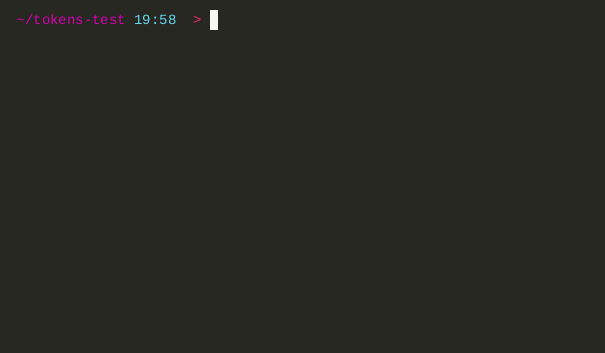

# Installation
<ol>
   <li> download latest binary from <code><a href="https://github.com/readyyyk/little-pswd-mgr/releases">realises</a></code> </li>
   <li> to make <code>tokens</code> accessible from anywhere type: </li>
</ol>

```bash
echo -e "\n$(printf 'PATH=\"$PATH:%s\"' $(pwd))\n" >> ~/.bashrc | source ~/.bashrc
```

> or change `$(pwd)` to your installation path
> > `pwd` pastes your current terminal directory

# Usage

| flags              | data format            | description                                    | 🚩 | 
|--------------------|------------------------|------------------------------------------------|----|
| <no flag\>         |                        | logs saved data                                |    |
| `-h` _or_ `--help` |                        | shows help message                             |    |
| `-a` _or_ `--add`  | "`data` `user`@`host`" | adds new                                       |    |
| `-d` _or_ `--del`  | `user`@`host`          | deletes one                                    |    |
| `-s` _or_ `--sort` | `string`               | logs only records that contain provided string |    |

# Examples
### Log all data
> ``` bash
> tokens
> ```
> Output:
>
> ```
> DATA  USER  @  HOST           
> ───────────────────────────────
> 123   test  @  todooos.live   
> qwe    zxc  @  localhost:5541
> root  root  @  localhost
> ``` 

### Help
> ``` bash
> tokens -h
> ```
> ``` bash
> tokens --help
> ```
> Output:
>
> `<help output>`

### Log sorted data
> ``` bash
> tokens -s localhost
> ```
> ``` bash
> tokens --sort localhost
> ```
> Output: (but with colors)
>
> ```
> DATA  USER  @  HOST           
> ─────────────────────────────── 
> qwe    zxc  @  localhost:5541
> root  root  @  localhost
> ``` 

### Adding
> ``` bash
> tokens --add "my_password qwerty@github.com"
> ```
> ``` bash
> tokens -a "my_password qwerty@github.com"
> ```
> Output:
>
> `Added`

### Deletion
> ``` bash
> tokens --del raeadyyyk@github.com
> ```
> ``` bash
> tokens -d "raeadyyyk@github.com"
> ```
> Output:
>
> `Deleted`
>
> or
>
> `Not found record with user: raeadyyyk for host: github.com`

# TODO
- Encrypt data file